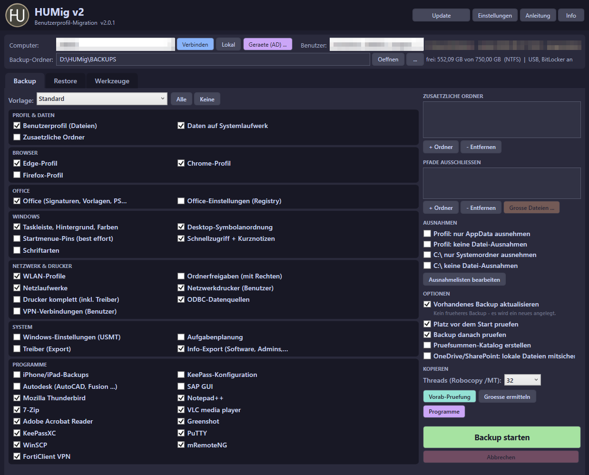
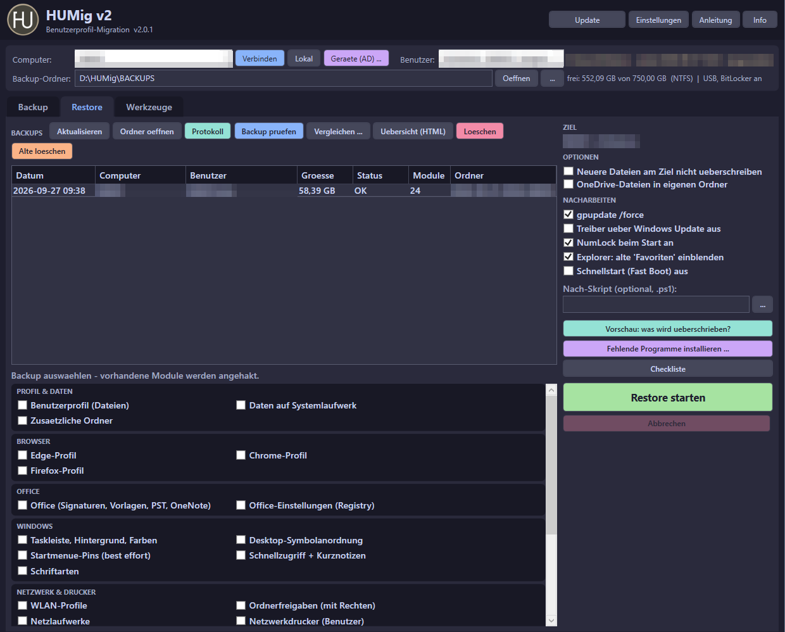
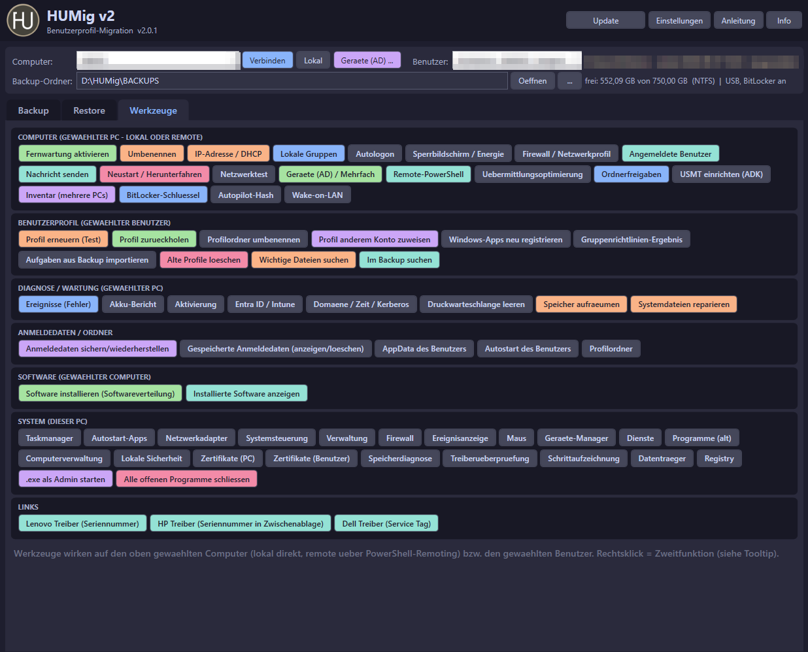

<h1 align="center"> HUMig v2</h1>

<b>Benutzerprofil-Migration und PC-Werkzeuge für Windows 10/11</b> 
Profile sichern und auf denselben oder einen neuen PC zurückspielen – per USB-Laufwerk oder über das Netzwerk.

  
  
  
  
  

  <a href="Docs/Anleitung.html"><b>Anleitung</b></a> ·
  <a href="INSTALL.md">Installation</a> ·
  <a href="CHANGELOG.md">Änderungen</a> ·
  <a href="LICENSE">Lizenz</a>

---

| | |
|---|---|
| **Backup & Restore** | Dateien, Browser, Office, Windows-Einstellungen, Drucker, WLAN, Netzlaufwerke – Robocopy mit bis zu 128 Threads, inkrementell, mit Prüfung |
| **Programm-Katalog** | erkennt 45+ Programme, sichert deren Einstellungen und **Lizenzdateien** mit, installiert fehlende am neuen PC nach |
| **Sicher** | Vorschau vor dem Restore, Prüfsummen-Katalog, Cloud-Dateien (OneDrive, SharePoint …) werden nie heruntergeladen |
| **Werkzeuge** | Fernwartung, AD-Mehrfachaktionen, Inventar, Autopilot-Hash, BitLocker, Profil-Reparatur, Diagnose, Softwareverteilung |
| **Server-Backup** | Hyper-V-VMs je Schule/Standort auf rotierende USB-Platten (Windows Server-Sicherung), Host-Konfiguration mit Switch-Wiederherstellungs-Skript, Verlauf und Statistik |
| **Benutzer-Modus** | ohne Administratorrechte: eigenes Profil sichern/wiederherstellen, Dateien aus dem Backup holen |
| **Anleitung** | im Tool mit **F1** – immer aktuell aus diesem Repository |

<table>
  <tr>
    <td align="center"> Backup</td>
    <td align="center"> Restore</td>
    <td align="center"> Werkzeuge</td>
  </tr>
</table>

**Schnellstart:** `Pull.ps1` in einen Ordner legen und ausführen (`powershell -ExecutionPolicy Bypass -File Pull.ps1`), dann **Start.cmd** – ab dem zweiten Start **HUMig.exe** (Administrator) bzw. **HUMig-Benutzer.exe** (Benutzer-Modus).

## Prinzip

| Was | Wie |
|---|---|
| Dateien (Profil, C:\, Zusatzordner, App-Ordner) | Robocopy mit bis zu 128 Threads und Ausnahmelisten |
| Benutzer-Einstellungen | Registry-Export aus dem Hive des Benutzers - wird automatisch geladen, wenn er nicht angemeldet ist |
| Windows-Einstellungen (optional) | Microsoft USMT (ScanState/LoadState), legt beim Restore auch das Profil an |
| Inkrementell | Vorhandenes Backup desselben PCs/Benutzers wird weitergefuehrt - nur neue/geaenderte Dateien werden kopiert |
| Sicherheit | Platzpruefung vor dem Start, Pruefung danach (Vergleich + SHA-256-Stichprobe), **Pruefsummen-Katalog** (spaeter jederzeit pruefbar), Warnung bei unverschluesseltem USB-Laufwerk (BitLocker To Go direkt aus dem Tool) |
| Programme | **Programm-Katalog** erkennt installierte Programme, sichert deren Einstellungen mit, nennt Lizenz-Hinweise und Nacharbeiten und installiert fehlende Programme am neuen PC aus der Softwareverteilung |
| Protokoll | `Bericht_Backup.html` / `Bericht_Restore_*.html` (druckbar, mit Unterschriftsfeldern und abgehakter Checkliste), `manifest.json`, `Pruefsummen.tsv`, `HUMig.log`, `Robocopy.log`; `Backups.html` = Uebersicht aller Backups im Backup-Ordner. Absichtlich ausgelassene Dateien (versteckt/System wie `pagefile.sys`, Nur-Cloud, Ausschlussmuster) werden getrennt ausgewiesen - kein Fehler |

## Bedienung

1. **Computer** waehlen (dieser PC, Name/IP oder **Geraete (AD) ...**) -> **Verbinden** -> **Benutzer** waehlen
2. Reiter **Backup**: Vorlage oder Module anhaken -> *Vorab-Pruefung* / *Groesse ermitteln* (Groesse je Modul + Summe, Rechtsklick = alle Module) -> **Backup starten**.
   Beim Verbinden werden installierte Programme erkannt: deren Einstellungen erscheinen in der Gruppe *Programme* und sind angehakt (Knopf *Programme* = Uebersicht)
3. Reiter **Restore**: Backup waehlen (vorhandene Module werden angehakt), Zielbenutzer im Kopfbereich -> optional *Vorschau* -> **Restore starten** -> Checkliste abhaken
   (*Fehlende Programme installieren ...* vergleicht Backup und neuen PC und installiert aus der Softwareverteilung)
4. Reiter **Werkzeuge**: fuer den gewaehlten Computer/Benutzer (lokal oder remote) - siehe unten

Linksklick = Hauptfunktion, Rechtsklick = Zweitfunktion (steht im Tooltip). Konsole: Rechtsklick = leeren.
Anzeige-Groesse: **Strg + Mausrad** bzw. Strg + Plus/Minus, **Strg + 0** = automatisch (kleine Bildschirme werden automatisch verkleinert) - auch in Einstellungen > Allgemein.
Alle Haekchen, Optionen und die zuletzt gewaehlte Vorlage werden gespeichert und beim naechsten Start wieder gesetzt.
Am Ende laengerer Vorgaenge: Ton, Windows-Hinweis und blinkendes Taskleisten-Symbol (mit Fortschritt im Symbol).
Start ueber **HUMig.exe** (wird beim ersten Start erzeugt, an Taskleiste anheftbar) oder **Start.cmd**.
**Benutzer-Modus** (ohne Administratorrechte): **HUMig-Benutzer.exe** bzw. **Start-Benutzer.cmd** - nur das eigene Profil auf diesem PC, Module mit Systemzugriff und die meisten Werkzeuge sind ausgeblendet, die Backup-Liste zeigt nur eigene Backups.
Mehrere Standorte: Einstellungen > **Standorte** (Name frei waehlbar; eigener Backup-Ordner, Softwareverteilung, USMT, Netzwerk-Standardwerte je Standort) - Umschalten oben rechts im Hauptfenster.

## Module (Auszug)

Profil-Dateien, Daten auf C:\, Zusatzordner, Edge, Chrome, Firefox, Office (Signaturen, Vorlagen, PST, OneNote), Office-Registry,
Taskleiste/Hintergrund/Farben, Desktop-Symbole, Startmenue (best effort), Schnellzugriff + Kurznotizen, Schriftarten,
WLAN, Netzlaufwerke, Netzwerkdrucker, Drucker komplett (PrintBrm), Ordnerfreigaben (mit Rechten), ODBC, VPN, USMT, Aufgabenplanung, Treiber, Info-Export,
iPhone-Backups, KeePass, Autodesk. Eigene Module: `Config\modules.json` (Ordner, Dateien, Registry-Schluessel - ohne Programmierung).

**Programm-Katalog** (`Config\apps.default.json`, eigene Eintraege in `Config\apps.json`): rund 40 Programme - u.a. Firefox, Chrome, Edge, Microsoft 365,
Thunderbird, Notepad++, 7-Zip, VLC, LibreOffice, Acrobat/Foxit, GIMP, Inkscape, Audacity, Paint.NET, OBS, VS Code, KeePass/KeePassXC,
FileZilla, PuTTY, WinSCP, mRemoteNG, AnyDesk, TeamViewer, FortiClient VPN, Zotero, Citavi, Arduino, GeoGebra, SketchUp, Autodesk,
SMART Notebook, ActivInspire, Untis, Packet Tracer, Zoom, Teams. Je Programm: was uebertragbar ist (Einstellungen), Lizenz-Hinweis,
Nacharbeiten (landen in der Checkliste) und passendes Paket der Softwareverteilung. Eintraege ohne Dateien/Registry dienen nur als Hinweis.
**Lizenzen mitnehmen:** Programme mit Lizenzdatei/-schluessel (z.B. WinRAR `rarreg.key`, Total Commander `wincmd.key`, Beyond Compare, Sublime Text) werden mit Lizenz gesichert und sind am neuen PC gleich registriert (Modulname *(+ Lizenz)*).
Eigene Programme in `Config\apps.json` - Eintrag mit `"License": true`, z.B.:
`{ "Apps": [ { "Id": "App_MeinTool", "Name": "Mein Tool", "Detect": "^Mein Tool", "Items": [ { "Type": "Files", "Name": "LIC", "Path": "{PROGRAMFILES}\\MeinTool", "Filter": [ "*.lic" ], "License": true } ] } ] }`
Nicht uebertragbar sind Lizenzen, die an Konto oder Hardware gebunden sind (Microsoft 365, Adobe, Autodesk ...) - dafuer gibt es Hinweise in der Checkliste.

## Backup-Optionen

| Option | Wirkung |
|---|---|
| Vorhandenes Backup aktualisieren | Gibt es schon ein Backup dieses PCs/Benutzers, wird es weitergefuehrt (umbenannt auf das aktuelle Datum). Nicht gewaehlte Module aus frueheren Durchlaeufen bleiben erhalten; geloeschte Dateien bleiben im Backup. |
| Platz vor dem Start pruefen | Simuliert das Backup gegen das Ziel (zaehlt nur, was wirklich kopiert wird) und startet nicht, wenn der Platz nicht reicht (Rueckfrage: trotzdem starten). |
| Backup danach pruefen | Vergleich Quelle/Backup und Pruefsummen-Stichprobe (SHA-256) unveraenderter Dateien. |
| Pruefsummen-Katalog | Standard aus. SHA-256 aller Dateien im Backup (`Pruefsummen.tsv`, inkrementell - der erste Lauf dauert lange). Reiter Restore > *Backup pruefen* erkennt spaeter beschaedigte/fehlende Dateien (USB-Stick, NAS). Rechtsklick = Katalog fuer aeltere Backups erstellen. |
| OneDrive/SharePoint: lokale Dateien mitsichern | Aus: Cloud-Ordner werden ausgelassen. Ein: nur Dateien, die am PC vorhanden sind - Nur-Cloud-Dateien werden nie heruntergeladen. |
| Pfade ausschliessen | Einzelne Ordner/Dateien weglassen - auch direkt aus *Grosse Dateien ...* (groesste Ordner und Dateien der letzten Messung). |

Vorlagen: Standard, Komplett, Nur Browser + Office, Neuer PC (mit USMT), **Notebook** (ohne C:\\), **Buero-PC** (mit Druckertreibern, Schriftarten), **Minimal** - eigene in `Config\modules.json`.

## Restore und Backups verwalten

| Knopf / Option | Wirkung |
|---|---|
| Vorschau: was wird ueberschrieben? | Zeigt je Datei: neu / ueberschreibt aeltere Zieldatei / **Zieldatei neuer** / gleich - nach dem Restore auch als Kontrolle |
| Neuere Dateien am Ziel behalten | Robocopy `/XO`: am Ziel neuere Dateien werden nicht ueberschrieben |
| Checkliste | Nach dem Restore abhaken (Punkte in Einstellungen > Restore + Nacharbeiten der erkannten Programme) - Stand und Bemerkung landen im Restore-Protokoll |
| Fehlende Programme installieren ... | Programmliste des Backups mit dem Ziel-PC vergleichen, fehlende mit Paket nacheinander installieren |
| Backup pruefen | Gegen den Pruefsummen-Katalog (Ergebnis `Pruefung_*.txt`, Status in der Uebersicht) |
| Vergleichen ... | Zwei Backups (z.B. derselbe Benutzer vorher/nachher): geaendert, nur in A, nur in B |
| Uebersicht | `Backups.html` im Backup-Ordner: alle Backups mit Status, Groesse, Pruefung, Links zu den Protokollen (Filter, Sortierung) |
| Alte Backups ... | Aufbewahrung nach Regel: je PC + Benutzer die neuesten N behalten, aeltere nach X Tagen vorschlagen (Einstellungen > Allgemein) - Loeschen immer mit Rueckfrage |

Beim Restore werden mitgesicherte OneDrive-Dateien nie in den Sync-Ordner geschrieben (dort koennten neuere Cloud-Versionen ueberschrieben werden);
optional landen sie in `Profil\OneDrive-Wiederherstellung`.

## Softwareverteilung

Pakete in den Ordner `Softwareverteilung\` legen (oder im Fenster *Datei hinzufuegen*; anderer Ordner/Freigabe: Einstellungen > Allgemein):
- **eine Datei** (`.msi`, `.exe`, `.msp`) = ein Paket
- **ein Unterordner** = ein Paket mit allen Dateien (Installer + Zubehoer); Ordner mit `_` am Anfang werden ignoriert

Das Tool liest die Installer aus und schlaegt die Silent-Parameter vor (MSI-Eigenschaften, Inno Setup, NSIS, WiX Burn, InstallShield,
Advanced Installer, Squirrel, 7-Zip-SFX - bei unbekanntem Framework nur geraten, Herstellerdoku pruefen). Pro Paket gespeichert:
Name, Installer, Parameter, Erkennung (ProductCode oder Name + Mindestversion), Erfolgs-ExitCodes, Timeout.
Installiert wird auf dem **gewaehlten Computer** oder auf **mehreren PCs** (bis zu 8 gleichzeitig); bereits installierte werden uebersprungen.

**Installierte Software** (Werkzeuge): Liste des gewaehlten Computers mit Filter, CSV und Drucken. Markierte Programme
lassen sich direkt **deinstallieren** (nacheinander, still, ohne automatischen Neustart): MSI per `msiexec /x`, sonst der
stille Befehl des Herstellers bzw. der Deinstaller mit Parametern (Vorschlag fuer Inno Setup/NSIS, vor dem Start pruefbar).
Ergebnis je Programm in der Konsole (entfernt / Neustart noetig / Fehler mit ExitCode), danach wird die Liste neu geladen.

## Werkzeuge

| Bereich | Werkzeuge |
|---|---|
| Computer | Fernwartung aktivieren (WinRM, RDP, C$, Firewall - ueber WMI), Umbenennen, IP-Adresse/DHCP, lokale Gruppen (Admins, Netzwerkkonfigurations-Operatoren, RDP, Benutzer), Autologon (LSA-Geheimnis), Sperrbildschirm/Energie, Firewall/Netzwerkprofil, angemeldete Benutzer abmelden, Nachricht, Neustart/Herunterfahren, Netzwerktest, **Geraete (AD) / Mehrfach** (Aktionen auf vielen PCs parallel), **Remote-PowerShell/-CMD**, **Inventar mehrerer PCs** (CSV, optional mit Software), **BitLocker-Schluessel** (in AD/Entra ID sichern), **Autopilot-Hash** (auch viele PCs in einer CSV), **Wake-on-LAN**, **Laufwerke (C$)** (auch USB-Sticks und Freigaben am Remote-PC im Explorer), **Uebermittlungsoptimierung**, **Ordnerfreigaben** (Rechte anzeigen, aus Backup uebernehmen), **USMT einrichten (ADK)** |
| Benutzerprofil | Profil erneuern (Test) + zurueckholen, Profilordner umbenennen, **Profil einem anderen Konto zuweisen** (Domaene -> lokal), Windows-Apps neu registrieren, Gruppenrichtlinien-Ergebnis, Aufgaben aus Backup importieren, **alte Profile loeschen**, **wichtige Dateien suchen** (PST, KeePass, Access ... ausserhalb des Profils), **im Backup suchen** (einzelne Dateien herauskopieren) |
| Diagnose / Wartung | Ereignisse, Akku-Bericht, Aktivierung Windows/Office, Entra ID/Intune (Status + Sync), Domaene/Zeit/Kerberos, Druckwarteschlange, Speicher aufraeumen (inkl. Windows.old), Systemdateien reparieren (DISM/SFC) |
| Software | Softwareverteilung, installierte Software + Deinstallation |
| Dieser PC | Systemprogramme, .exe als Admin, Anmeldedaten (credwiz, anzeigen/loeschen), Hersteller-Treiber-Links |

Remote-Werkzeuge brauchen PowerShell-Remoting (WinRM) am Ziel-PC - fehlt es, schaltet *Fernwartung aktivieren* es ueber WMI (Port 135) ein. Aenderungen erfolgen immer mit Rueckfrage;
Profil-Werkzeuge sichern vorher Registry (und Dateirechte) unter `C:\ProgramData\HUMig` am Ziel-PC.

**Profil einem anderen Konto zuweisen:** nicht uebertragbar sind mit Windows-DPAPI verschluesselte Daten
(gespeicherte Kennwoerter in Browser/Anmeldeinformationsverwaltung, Zertifikate mit privatem Schluessel, EFS);
OneDrive/Office/Teams neu anmelden. Entra-ID-Konten werden nicht unterstuetzt. Vorher ein Backup machen.

## Server-Backup (Hyper-V-Host)

Reiter **Server-Backup** (nur als Administrator auf einem Hyper-V-Host sichtbar):

- **Profile** je Schule/Standort (Name frei, umbenennbar mit Verlauf; Kopie auf jeder Platte): VMs, Platten-Bezeichnung (z.B. `HUMIG-SCHULE1-1`, `-2` ...), Anzahl Platten (Rotation + ausgelagert), Optionen
- **Platte einrichten**: nur USB-Platten, loeschen + GPT + NTFS 64K + Bezeichnung; Platten werden beim Anstecken an der Bezeichnung erkannt
- **Sichern** mit `wbadmin start backup -hyperv` (online ueber VSS), danach Pruefung (Version + enthaltene VMs), optional Host-System (`-allCritical`)
- **Host-Konfiguration**: virtuelle Switches, SET-Teams, Host-vNICs mit VLAN, IP, Netzwerkkarten, VM-Einstellungen als HTML/JSON + `Restore-VMSwitches.ps1`
- **Verlauf/Statistik** auf der Platte und im Tool-Ordner: letzte Sicherung je Platte, Rotationsempfehlung, Warnung nach 14 Tagen
- **Auswerfen** (Schreibcache leeren), **Versionen**, **Wiederherstellen** ueber die Windows Server-Sicherung

Voraussetzung: Feature *Windows Server-Sicherung* (installierbar aus dem Reiter).

## Grenzen

- Gespeicherte Browser-Kennwoerter/Cookies: durch Windows-Verschluesselung meist nicht uebertragbar -> Browser-Sync verwenden
- Taskleisten- und Startmenue-Pins unter Windows 11 nur eingeschraenkt
- USMT: keine Migration zwischen AD- und Entra-ID-Geraeten (laut Microsoft)
- OneDrive/SharePoint: Standard = auslassen (Cloud); Nur-Cloud-Dateien werden auch mit Option nie heruntergeladen
- Pruefsummen-Stichprobe direkt nach dem Backup = Stichprobe; die Vollpruefung macht *Backup pruefen* mit dem Katalog
- Programm-Katalog: Pfade/Registry-Schluessel nach Herstellerangaben bzw. Erfahrung (best effort) - Lizenzdateien nur bei Programmen mit *(+ Lizenz)*, konto-/hardwaregebundene Lizenzen nie
- Wake-on-LAN ueber VPN/Router meist nur mit *Senden ueber PC* im selben Netz

## Konfiguration

Alles ueber **Einstellungen** (Fenster). Die Werte landen in:

| Datei | Inhalt |
|---|---|
| `Config\settings.json` | Backup-Ordner, Threads, Aufbewahrung (Tage + Anzahl je PC/Benutzer), USMT-Pfad, Softwareverteilung-Ordner, WLAN-Klartext, Backup-Optionen, Nacharbeiten, Checkliste, Standorte (`Profiles`, `ActiveProfile`), Links, Modul-Anzeige, letzte Vorlage, Benachrichtigung (`Notify`), Uebersicht (`OverviewAuto`) |
| `Config\apps.json` | eigene Eintraege fuer den Programm-Katalog (Aufbau wie `apps.default.json`) |
| `Config\exceptions.json` | Ausnahmen Ordner/Dateitypen fuer Profil und C:\ |
| `Config\modules.json` | eigene Module und Vorlagen |
| `Config\update.json` | andere Update-Quelle `{ "Owner": "...", "Repo": "...", "Branch": "main" }` |

Die `*.default.json` kommen mit dem Update, eigene Dateien bleiben erhalten.

Installation: [INSTALL.md](INSTALL.md) | Anleitung: [Docs/Anleitung.html](Docs/Anleitung.html) | Aenderungen: [CHANGELOG.md](CHANGELOG.md)

**Lizenz:** kostenlose Nutzung erlaubt, Veraenderung und Weitergabe veraenderter Fassungen nicht - Details in [LICENSE](LICENSE).
